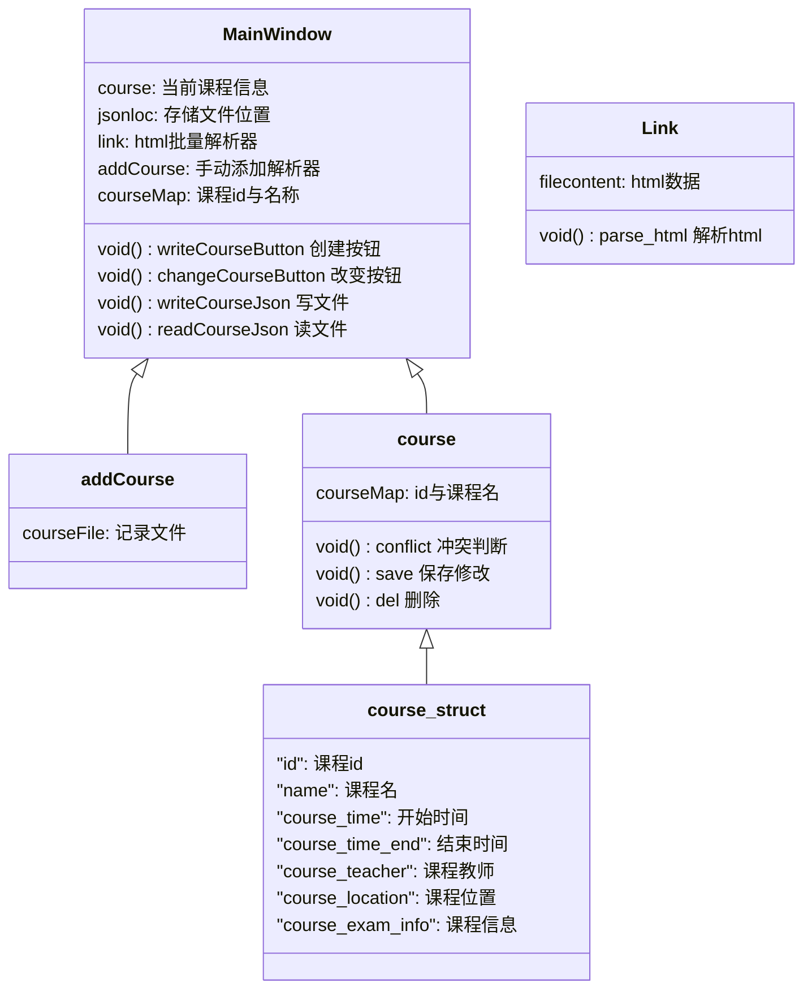

# 基于QT的多功能课程表————项目报告
[TOC]

## 项目目标

由于北大学生在开学选课后，学校不能很快的给出课程表，基于选课网上的选课结果，想尽快的生成自己的课程表，同时可以随意添加自己想加入的未选课的课程，并在此基础上记录一些课程信息或deadline等信息。我们实现了一个基于QT的多功能课程表。

主要功能：

* 网上下载课程的导入
  * 基于账户和密码自行导出课程表
  * 【实现】基于爬虫的html解析课程表
* 【实现】课程表管理
  * 手动添加和批量添加课程
  * 课程项目修改，包括时间、考试信息、课程地点等等
  * 课程冲突判断
  * 导出导入课程表存储
* 课程信息管理
  * 针对课程添加DDL
  * 定期DDL提醒


## 项目界面与交互

**Qt课表**主要由主窗口呈现，主窗口可以展示一个完整的二维课程表。


在此基础上，提供了以下几种交互。

- 可以通过“添加课程”按钮，进入添加课程界面，输入新的课程信息，返回后在课表中展示新的课程。

  

  支持对添加课程名，时间，地点，教室，考试信息等

- 可以点击“批量导入课程”按钮，进入导入课程界面，通过预先从选课网的选课结果网页保存html网页文件，输入文件地址，以及要保存到的文件地址（以`.json`文件来保存课程信息），就可以自动从html文件解析出其中的课程信息，自动保存并展示到主窗口课程表中。

  

  输出的文件以`.json`格式来存储，具体结构是：

  ```json
  {
      "Course":
      {
          [
          {
              "id": course_id,
              "name": name,
              "course_time": start_time,
              "course_time_end": end_time,
              "course_teacher": course_teacher,
              "course_location": course_location,
              "course_exam_info": course_exam_info,
          }, {
              ...
          }
          ]
      }
  }
  ```

  这里`html`转到`json`主要实现了一个基于北京大学学生的课程表下载后的内容的`html parser`，主要通过正则识别匹配文件中的课程名称、开始时间、教师、地点以及考试信息。

  【未实现】支持北大用户名密码登陆，自动获取网络`url`并爬取`html`，加载`parser`导出课表的功能

- 可以从主窗口课程表中，在表格上点击某一课程的方框，进入课程信息界面。可以查看课程信息，并进行修改或删除课程。

  

  可以修改的功能包括课程名、时间、地点、教师、考试信息等

  修改后，代码会自动判断课程的冲突情况，如果出现课程冲突，会阻止课程进行修改，并阻止存储文件的修改。

- 改变存储位置：点击菜单栏里的选择`json`文件可以更改路径，从而更改课表的存储位置：

  

  用户可以自行制定文件位置，该路径自动保存，不需要用户记忆：

  


## 类和文件结构

类图：



### 主窗口类 `MainWindow`:

- `MainWindow`类主要构建了主窗口的界面，并包含了创建课程表格的相关函数，以及与其他界面的信号传递。
- 首先在主窗口中构建表格的形式。通过读取`json`文件中的`course`组，来将每个课程画为一个框，在框上展示基本的课程信息，从而构建展示课程表。
- 在构建课程的框的同时，也使框成为了可以点击的按钮。通过点击按钮，后端可以查找id在`courseMap`中找到对应的课程，知道点击的是哪个课程，从而从`json`文件中读取课程信息，进入课程信息界面。后续见课程信息界面的介绍。
- 在主窗口左侧，有“添加课程”按钮，可以进入添加课程界面。通过将信息输入到对应的输入框中，点击“确认”按钮，就可以将课程信息添加到`json`文件中，并返回主窗口，展示出来。
- 在主窗口左侧，还有“批量导入课程”按钮，进入导入界面。可以从选课网的选课结果网页的html文件进行解析，导出课程信息到`json`文件，再返回主窗口，展示出来。
- 在以任意形式的课程发生添加等变化时，`MainWindow`类都会更新，同时调用`AddCourseButton`函数。该函数实现了从课程信息如`CourseName`、`Teacher`、`Location`等信息，在表格中构建一个课程框，同时将课程框在`ui`上更新为一个新的按钮，同时给课程一个id，将课程框按钮与id以及课程信息绑定，保存到`courseMap`中以及`json`文件中，从而实现了可以在主窗口中对特定的课程直接进行交互。
- 通过信号控制的读写函数，`readCourseJson`和`writeCourseJson`分别对用户指定的`json`文件进行读写，从而对不同窗口返回的课程信息进行读写操作。
### 添加课程 `Addcourse`类：
- `Addcourse`类主要构建了添加课程的界面，并与主界面实现了信号传递。
- 界面主要由添加课程信息的内容，点击“保存”，即会对所选择的课程内容修改，并实时修改课表中的内容

### 从HTML文件导入课程` Link`类：

* `Link`类主要构件批量从`html`导入`json`的文件类，执行`html parser`的功能，并直接进行`json`路径的存储
* 窗口包括两个行输入框，`json`输入框指定用户的`json`的库文件路径，执行后，系统的`json`库路径自动调整到相应的位置，并且在不修改`MainWindow`窗口的“加载”按钮之前，不会发生改变，即所有的读写操作都会在该路径下的`json`中执行
* `html`输入框制定用户的`html`的文件路径，点击确定后，即会对`html`内容进行解析，并逐一将课程内容导入到`json`文件存储起来

### 修改课程的`Course`类：

* 该类的结构体`course`存储课程的名称、`id`、地点、教师、考试、时间等信息

* 归类的窗口包括左侧的操作按钮，包括“保存修改”，”删除课程“和”返回“组成，保存修改支持对课程任意信息的更改，由于`course_id`在过程中不改变，窗口保存修改后，可以根据`course_id`在`json`中及时进行修改
* 选择“删除课程”按钮，弹出确认删除，点击“确认删除”后，即会将课程删除，并直接对`json`进行修改
* 选择“返回”按钮，直接返回`MainWindow`界面


## 项目展望及反思

### 项目反思

**Qt课表**主要锻炼了我们组员同学的面向对象编程以及“信号异步”处理能力，大部分的窗口需要不同的类实现，窗口之间的跳转和信息传递需要类之间的传递。

* 信号传递的异步性与共享变量

  在实践时，我们发现同一个窗口在按钮“发送信号“时，可能会出现异步执行的情况，即两个信号接近到达某个类，信号顺序确定但类的处理过程不确定，从而造成不确定性：

  ```c++
  // 处理修改课程信号 
  connect(&course,&course::changeCourseTableSignal,this,&MainWindow::changeCourseWrite);
  // 处理添加课程信号
  connect(&addCourse,&AddCourse::addCourseTableSignal,this,&MainWindow::addCourseWrite);
  
  ```

  在执行`changeCourseWrite`和`addCourseWrite`时，可能出现先后执行的竞争

* 数据库选择与用户信息存储

  * 没有选择`MySQL`的原因

    `sql`相比`json`需要用户拥有独立数据库运行的能力，或者具有网络连接，这有时是高要求的，本课表主要通过`json`存储用户信息，一方面此类非关系数据系统可以比较方便地存储课表中的信息元组，另一方面适用所有的硬件和系统

  * `json`存储的问题

    `json`的问题每一次进行写操作时，需要将文件全体读入修改后覆盖式地写入文件，也即造成写入大的文件时可能造成一定的内存限制，但课表系统不会产生太大的文件，影响不大；另一方面，`json`存储需要软件制定文件的存储位置，我们的实现方法是将`json`路径设为默认的`./course.json`，如果用户直接打开文件进行操作，会在默认路径进行操作，为了提供更多的存储位置方便导出，提供自定义的`json`位置；

    `json`格式具有一定的语法结构，错误的机构会导致本程序无法运行，当然用户也没有修改的余力，只能从新修改，这也是我们没有实现的部分，需要对错误的`json`文件进行分支判断。

* 相关的错误处理不足

  缺乏错误处理函数。

### 项目展望

**Qt课表**还有很多可以实现的功能，鉴于时间限制，目前仅能够支持课表的导入解析，以及存储方式：

* 【主要功能】实现课程DDL的管理
* 【主要功能】实现课程的拖拽，课程表缩放，以及支持更强大的`html parser`
* 【主要功能】实现更加方便的`json`存储，例如保存，导出课表
* 代码重构：代码结构简介，但相应的命名有待考量
* UI界面不够美观

